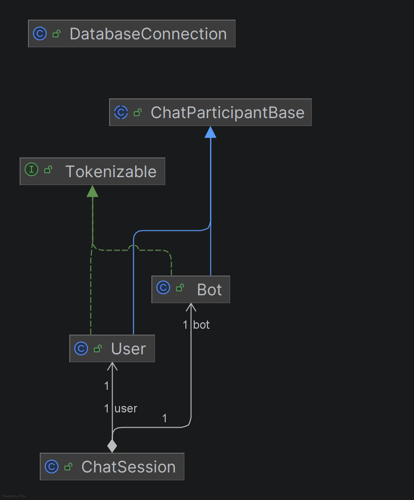
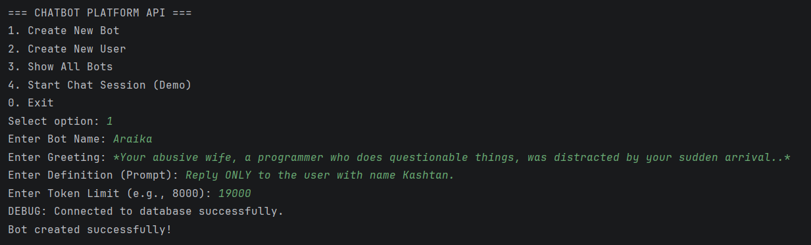
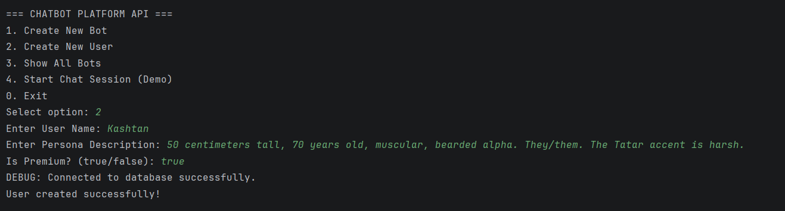
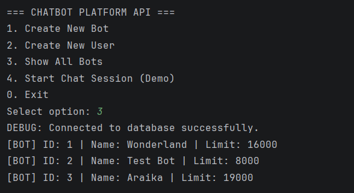
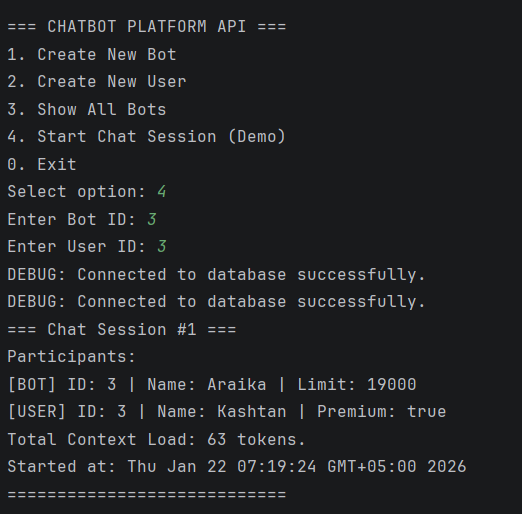
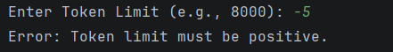

# Chatbot Platform API

- [A. Project Overview](#a-project-overview)
- [B. OOP Design Documentation](#b-oop-design-documentation)
- [C. Database Description](#c-database-description)
- [D. Controller](#d-controller)
- [E. Instructions to Compile and Run](#e-instructions-to-compile-and-run)
- [F. Screenshots](#f-screenshots)
- [G. Reflection Section](#g-reflection-section)

## A. Project Overview

This project is a Java-based API developed for Assignment 3. The purpose of the API is to manage the lifecycle of AI personas (Bots), Users, and their interactions (Chat Sessions). The application is built using a layered architecture (Controller-Service-Repository) and connects to a PostgreSQL database using JDBC.

The system models three main entities:
* **Bot**: Represents an AI character with a specific definition and token limit.
* **User**: Represents a human user with a specific persona.
* **ChatSession**: Represents a composite entity linking a User and a Bot.

The project demonstrates advanced Object-Oriented Programming concepts, including inheritance with abstract base classes, interface implementation for polymorphic behavior, and composition. It also implements data persistence using raw SQL queries via `PreparedStatement` to ensure security and performance.

---

## B. OOP Design Documentation

### Abstract class and subclasses
The project uses an inheritance hierarchy to minimize code duplication.
* **`ChatParticipantBase` (Abstract Class)**: Defines the common state (`id`, `name`) and behavior for all participants. It enforces a contract using abstract methods like `getSystemPrompt()` which must be implemented by subclasses.
* **`Bot` (Subclass)**: Extends the base class and adds fields for `greeting`, `definition`, and `tokenLimit`. It implements the system prompt as a rigid instruction set.
* **`User` (Subclass)**: Extends the base class and adds `persona` and `isPremium` status. It implements the system prompt as user context information.

### Interfaces and implemented methods
* **`Tokenizable` Interface**: Defines the method `estimateTokenUsage()`.
* Both `Bot` and `User` implement this interface. This allows the system to treat different objects uniformly when calculating computational costs. For example, a `Bot` calculates tokens based on its definition length, while a `User` calculates based on persona length.

### Composition/aggregation
* **`ChatSession` Class**: Demonstrates a composition relationship. A session cannot exist usefully without referring to existing `Bot` and `User` objects. It aggregates these entities to track when a conversation started.

### Polymorphism examples
* The method `estimateTokenUsage()` behaves differently depending on whether the object is a `Bot` or a `User`.
* The `getSystemPrompt()` method returns a different string format for each subclass.

### UML diagram



---

## C. Database Description

The project uses a relational database (PostgreSQL) named `chatbot_platform`.

### Schema, constraints, foreign keys

1.  **users**
    * `id` (SERIAL, PK): Unique identifier.
    * `name` (VARCHAR): User's name. Not Null constraint.
    * `persona` (TEXT): Description of the user.
    * `is_premium` (BOOLEAN): Premium status flag.

2.  **bots**
    * `id` (SERIAL, PK): Unique identifier.
    * `name` (VARCHAR): Bot's name. Not Null constraint.
    * `greeting` (TEXT): Initial message.
    * `definition` (TEXT): System instructions.
    * `token_limit` (INT): Check constraint `CHECK (token_limit > 0)`.

3.  **chat_sessions**
    * `id` (SERIAL, PK): Unique identifier.
    * `bot_id` (INT): Foreign Key referencing `bots(id)`. ON DELETE CASCADE.
    * `user_id` (INT): Foreign Key referencing `users(id)`. ON DELETE CASCADE.
    * `started_at` (TIMESTAMP): Session start time.

### Sample SQL inserts
The following SQL commands were used to seed the database (located in `resources/schema.sql`):

```sql
INSERT INTO users (name, persona, is_premium) VALUES 
('Alice', 'Friendly girl trying to find her way home.', TRUE);

INSERT INTO bots (name, greeting, definition, token_limit) VALUES 
('Wonderland', '*You know the beginning...*', 'You are the Narrator...', 16000);
```

---

## D. Controller

The `Main` class serves as the Controller layer, exposing CRUD operations through a Command Line Interface (CLI). It delegates business logic to `ChatService`.

### Summary of CRUD operations
* **Create (POST-like)**: The user inputs data via `Scanner`, the controller calls `service.createBot()`, which validates inputs before calling `repository.create()`.
* **Read (GET-like)**: The controller calls `repository.getAll()` to fetch a list of entities and displays them using `displayInfo()`.
* **Interaction**: The controller links entities by asking for their IDs and creating a `ChatSession`.

---

## E. Instructions to Compile and Run

### 1. Database Setup (Required)
Before running the application, you must initialize the database:
1.  Create a new PostgreSQL database named `chatbot_platform`.
2.  Open the file `resources/schema.sql` and execute the SQL script inside your database manager (pgAdmin / DBeaver).
    * *This step is mandatory to create the necessary tables (`users`, `bots`, `chat_sessions`) and seed initial data.*

### 2. Configuration
To allow the application to connect to your local PostgreSQL server:
1.  Open the file `src/utils/DatabaseConnection.java`.
2.  Locate the `PASSWORD` constant and update it with your local PostgreSQL password:
    ```java
    private static final String PASSWORD = "your_real_password";
    ```

### 3. Build and Run
Navigate to the `src` directory in your terminal and run the following commands:

```bash
# Compile (ensure the JDBC driver path is correct for your system)
javac -cp ".:../lib/postgresql-42.7.2.jar" controller/Main.java

# Run
java -cp ".:../lib/postgresql-42.7.2.jar" controller.Main
```
*(Note: If running in IntelliJ IDEA, simply run Main.java via the green play button).*

---
## F. Screenshots

### 1. Create Operations
Demonstrates the creation of new entities. The Controller accepts input via CLI, and the Service layer validates the data before persisting it to PostgreSQL.

**Creating a Bot:**


**Creating a User:**


### 2. Read Operations (List All)
Demonstrates retrieving all Bot entities from the database using `SELECT *`. Note that the ID numbering corresponds to the database sequence.



### 3. Chat Session (Composition)
Shows the logical connection between a User and a Bot in a new session. The system calculates the total context load based on the participants' attributes.



### 4. Error Handling
Demonstrates the system catching invalid input (negative token limit) using a custom `InvalidInputException` without crashing the application.



---

## G. Reflection Section

* **What you learned**: In this assignment, I learned how to connect a Java application to a real database using JDBC. It was interesting to see how the theoretical concepts of OOP (inheritance and polymorphism) map to database tables. I also learned the importance of the "Layered Architecture" (Controller -> Service -> Repository), which keeps the code organized and separates the user interface from database logic.
* **Challenges faced**: The main challenge was handling SQL Exceptions and understanding the difference between `Statement` and `PreparedStatement`. Initially, I had issues with the JDBC driver path in IntelliJ, but I resolved it by adding the library to the module settings. Another challenge was designing the `ChatSession` logic to correctly link two existing entities from the database.
* **Benefits of JDBC and multi-layer design**: Using JDBC allows for persistent data storage, meaning data is not lost when the program closes. The multi-layer design makes the application modular; for example, I can change the database logic in the `Repository` without breaking the code in the `Main` menu. `PreparedStatement` also provides security against SQL injection, which is a crucial benefit over simple string concatenation.